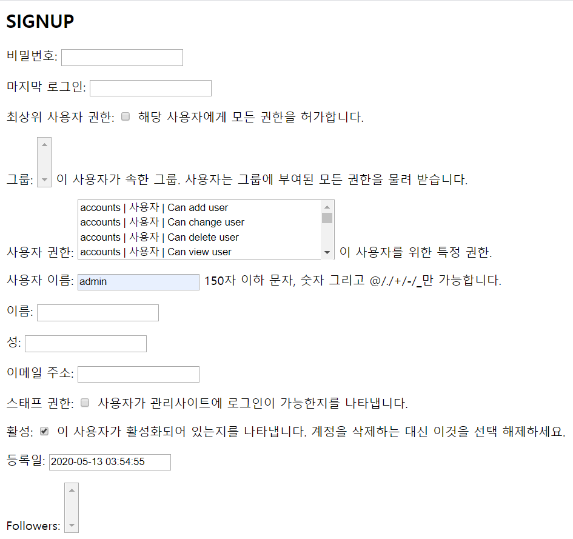
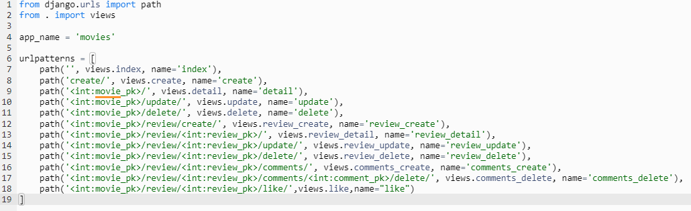

# 2020 05 14 django_pjt4 README

1. #### 역할분배

   이번 프로젝트는 워낙 마음이 잘 맞는 @@@이랑 하게 되어서, 분량을 따로 나누지는 않았다. Zoom 을 활용해서, 음성으로 대화하고, 거의 같은 부분을 같이 작성하는 방식으로 해서 **5:5의 비율**이 되었다.

2. #### 구현순서

   명세서가 역대 해보았던 모든 프로젝트 중에 **가장 자유도가 높았다**. 하지만 기본 기능은 비슷했다. Movie 의 CRUD (나중엔 필요 없던걸로 밝혀지긴 했지만), Review의 CRUD, Comment의 CRUD를 **각각 1:N, 1:N, 1:N 관계로 연결**하고, **Accounts 앱을 통해 좋아요와 팔로우 기능을 구현** 하는 것이었다. 기본적으로 Accounts 앱을 먼저 만들고, Movie -> Review -> Comment 순서로 만들었다. 

3. #### 기본 구성

   settings.py, base.html, 부트스트랩 CDN설정, 기본적인 navbar 구성, url base_dir 설정을 했다.

   user Model을 기본 Django제공 User 모델이 아닌 커스텀 모델을 사용할 거라서, settings.py 마지막에 `AUTH_USER_MODEL`을 설정해주었다.

4. #### ACCOUNTS

   1. **models.py 속 User설정이 가장 중요한데,**

   ```python
   from django.db import models
   from django.contrib.auth.models import AbstractUser
   from django.conf import settings
   
   class User(AbstractUser):
       followers = models.ManyToManyField(settings.AUTH_USER_MODEL, related_name='followings')
   ```

   다음과 같이 AbstractUser를 불러와, **팔로워, 팔로잉을 역참조 할 수 있도록** `related_name` 설정을 해주는 것이 중요하다.

   기본 Accounts `signup, login, logout, follow, profile` 기능을 구현하였다.

   ​	2. 다만 그 과정에서 중간에 signup의 `CustomUserCreationForm`의 인자값을 `__all__` 로 받으면 어떻게 되나 궁금해서 실험해 보았는데 다음과 같이 매우 개판으로 나왔었다. 바로 fields에 직접 지정 하는 방식으로 바꿨다.



​	3. **accounts 앱의 팔로우와 좋아요 기능을 어느 곳에 달아야 할지 UI/ UX 적인 측면에서 고민을 많이 했다.** 처음 accounts 앱을 만들 당시에는 서로의 프로필을 주소창에 직접 입력해야만 들어갈 수 있었기 때문에, 이후 movies app을 완성 한 후, 각자가 리뷰를 쓰면 그 리뷰를 쓴 사람의 리뷰 유저 네임에 accounts/profile 태그를 달아 들어가 그 사람을 팔로우 할 수 있도록 만들었다. 

#### 5. movies

1. **가장 어려웠던 것은 모델링이었다.**  accounts를 제외하고서라도, 1:N 이 3중으로 종속 되어 있는 관계를 어떻게 만들까 고민하는게 가장 까다로운 일 이었다. 처음엔 기능별로 app을 나누어 작업 하다가, 각 app끼리 url 정보를 넘기는 것에서 문제가 발생해서, 아예 movies라는 app 하나에 `movies`와 `reviews` `comments` 까지 전부 넣었는데, 이는 나중에 프로젝트를 싹 갈아 엎고, 그 뒤로도 url 설정과 views.py 에 인자값 넘겨주는 것에 매우 골머리를 썩게 만드는 결과를 가져왔다. 왜 강사님들이 `'하나의 앱, 하나의 기능'`을 강조 하시는지 몸소 깨우칠 수 있었다.

2. url patterns를 짜는 것부터가 고역이었다.
   

   url에 `movie_pk`, `review_pk`,`comments_pk`까지 세개를 중첩해서 쌓다보니 **views.py 에 인자값을 넘길때 고생했다.** url이 길어지는 것은 실제 개발할때는 어쩔 수 없이 오는 문제겠지만, 굳이 한 앱에서 저렇게 까지 할 필요는 없는 것 같다.

3. models.py 는 movie에 URLField()를 넣는 것. Review에 user정보와 like_users정보. movie ForeignKey를 넣는것. Comment에도 user정보를 넣어서 자신만 삭제가 가능하도록 했다.

4. class에 @@@ 형의 도움으로 `__str__` 을 넣었는데, 원하는 무비의 foreign key 값을 왼편엔 저장값, 오른쪽엔 출력값으로 설정해서 나중에 Review에서 movie를 참조할 때 사용 할 수 있도록 했다. 그 전엔 이걸 하는 법을 몰라 movie값을 exclude로 form에서 받아 오지 않고, commit=False로 넘기는 방법을 사용했었는데, 이런식으로 구현이 가능해서 신기하고 보람찼다.

   

5. **html 문서에서 오류가 나면 답이 없다**. review_detail에 movie namespace 가 없다는 문제로 한참을 골머리를 썩었는데, html은 정확히 어디에서 틀렸는지 정확히 파악하기 어렵기 때문에(bootstrap을 적용 시키면 bootstrap을 사용해서 html을 rendering 하는 부분에서 오류가 나는 것으로 파악을 하기 때문인 듯) 한 문장 한 문장 지웠다가 서버를 돌렸다가 하는 과정을 반복해서 디버깅을 해야하기 때문에 시간이 굉장히 오래 걸렸다. 틀렸던 부분은 html page에서도 


다음과 같은 부분에 **인자값을 여러개 넣어줘야 하는데**, review.movie.pk 와 같이 foreignkey 정방향으로 참조하는 것을 생각해내지 못해서 꽤 오랜 시간 헤매었다. 쿼리셋을 다루는 것에 더욱 익숙해져야 할 것 같다.

6. views.py 에서 가장 공을 들였던 부분은 처음으로 **오류** **message  구현**했다는 점이다.

   ```python
   @login_required
   def review_update(request, movie_pk, review_pk):
       review = get_object_or_404(Review,pk=review_pk)
       if request.user == review.user:
           if request.method == 'POST':
               form = ReviewForm(request.POST, instance=review)
               if form.is_valid():
                   form.save()
                   return redirect('movies:review_detail', movie_pk, review_pk)
           else:
               form = ReviewForm(instance=review)
           context = {
               'form': form
           }
           return render(request, 'movies/review_form.html', context)
       else:
           messages.warning(request,'접근권한이 없습니다.')
           return redirect('movies:review_detail', movie_pk, review_pk)
   ```

   이와 같은 방식으로  request.user가 review.user가 아닐 때 접근 권한이 없다는 메시지를 넘겨 줬는데, 이를 동작하기 위해선  settings.py에 아래와 같은 코드를 넣는 것이 신기했다.

   ```python
   MESSAGE_STORAGE = 'django.contrib.messages.storage.session.SessionStorage'
   ```

   

6. #### 총평

   그 전 장고 프로젝트를 할 때, CRUD 로직을 세우는 것은 코드의 진행 알고리즘을 따라 한다는 느낌이 강했는데, 이번 프로젝트는 자유도도 높고, 무엇보다도 모델링을 내가 주도적으로 진행해야 했기 때문에, 내가 직접 프로젝트를 **'만든다'**라는 개념이 강해 더욱 헤매고 어려웠던 것 같다.

   특히, **더욱 정교하게 첫 모델링 설계를 해야만 나중에 고생을 덜 한다**는 것을 깨달았다. 모델링은 마이그레이션을 다시 해야하기 때문에 모델링을 아무리 심사숙고하고 짜도 결국 또 기능을 하나하나 구현 할 때마다 수정을 하게 되고, 그때마다 migration을 처음부터 다시 시작하는 것은 여간한 노동이 아니었다. 처음부터! 잘하자!

7. #### 잘한 점

   1. html에 if문, is authenticated, views.py의 메시지 기능을 통해 '권한'에 대한 차등등급을 정밀하게 구성한 것.
   2. 메시지 기능, ForeignKey에서 select하는 기능 등 views.py 에서 새로운 기능들에 도전해봄
   3. user에게 보여지는 부분에 대한 UI/UX 고민을 많이 해보고, 각 기능들을 서로 엮으면서 재미를 느낌

8. #### 못한 점

   1. 3개의 모델링을 한 앱에 때려 박은 것(처음 설계는 여러 앱으로 했지만 쉬운길로 가고 싶어서 빨리 포기하고 한 앱에 때려 넣은것이 오히려 더욱 큰 독이 되었다.)
   2. 역참조, 정참조 등 객체를 받아올 때 쿼리문 다루는 것에 서툴러서 시간을 많이 낭비한 것.
   3. html에서 오타를 발견하지 못하고 시간을 많이 끈 것