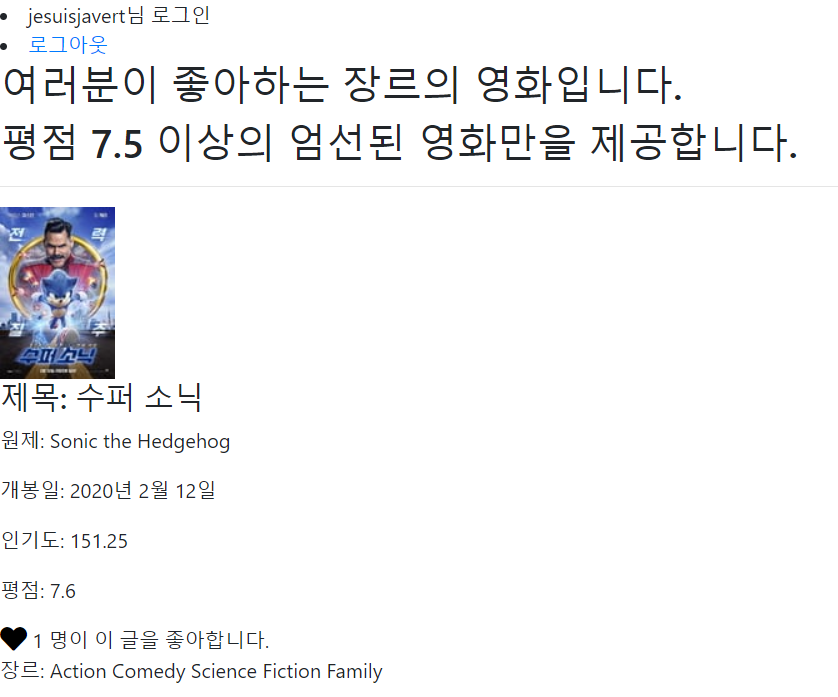

# 2020 05 20 django_pjt5 README

### 1. 역할분배

이번 프로젝트 역시 @@@과 맡게 되었다. 평소에 @@@는 아주 믿을만한 동료임에 틀림없지만, 문제는 이번주 @@@의 스케쥴 문제로, javascript 수업을 못 들은채로 함께하게 되어, javascript관련한 내용 전부와 모델링 부분을 내가 맡게 되어 프로젝트를 함에 있어서 어려움이 많았다. Zoom 을 활용해서, 음성으로 대화했고,  8:2의 비율로 대부분 내가 작성하게 되었다.

### 2. 구현순서 및 제작방향

크게는 명세서 순서에 따라 제작했다. 기본적으로 구현 할 아이디어를 여러가지 내었는데, 사실 시간과 정성이 훨씬 많이 드는 아이디어 위주로 나와, 최대한 간단하게 우리가 익숙한 기능을 구현하는 방식으로 구성회의를 하고, 앱 순서대로 `json데이터 입력 -> Accounts -> Movies` 순서로 만들었다.  
 우리가 만들기로 한 영화추천 알고리즘은 `원하는 장르를 선택하면, 그 영화를 인기도 순으로 10개씩 정렬하되, 평점이 7.5이상인 영화만 추천하는 것`. 장르 선택은 모델링 정방향 참조, 인기도 순 10개씩 정렬은 Bootstrap pagination, 평점 filtering은 쿼리셋 filtering으로 구현했다.

 또한, 필수 기능 이었던,  `'좋아요'의 활성화/비활성화는 AJAX 요청을 사용 해야 합니다.` 를 javascript로 구현하기 위해 axios 툴을 이용해야 했다.

### 3. 기본 구성

1. ##### 작업 환경

   - 이번 주 과제는 vscode를 활용한 가상환경에서 진행하기를 강사님들이 추천하셨지만, 가상환경을 zoom으로 보는 건, 한 명이 타이핑을 전적으로 도맡아서 해야하기 때문에 실시간으로 서로 다른 부분을 작성하는 팀프로젝트엔 어울리지 않는다고 판단해, 다시 c9을 활용해 작업을 했다. 실제로 코드를 봐가며 협업을 하더라도, 아이디어가 떠오른 한 명이 손을 놓고 다른 사람이 작성하는 걸 구경만 하는 건 굉장히 답답할 것 같다.

2. ##### 기본 django Setting

   - `부트스트랩` CDN설정, `axios` CDN 설정, django-`pagination`설정,`fontawesome`CDN 을  base.html 와 settings.py에 구성했다.  
   - 각각의 인터넷 사이트를 모두 즐겨찾기 했다. 대부분 startproject하는 법을 적어 놓았기에, 그런 문서들을 참고해서 적었다. 특히 bootstrap pagination 이 설정하는 법이 까다로웠는데, 여러 단계를 거쳐 사용할 수 있었다.

   - 그 외에도 createsuperuser를 통해 admin 페이지도 만들었다. id : admin / pw: 1

3. ##### `json` 데이터 불러오기

   1. 처음 기본 제공된 json 파일을 migration 하는 것을 처음 해봐, 몇번의 실수 끝에 해결 할 수 있었다. json data를 받아 오는 방법은 간단하나, 몇 번의 시행착오 끝에 겨우 해냈다.

      1. 기본 모델링을 완료한 뒤, makemigrations를 통해 틀을 만들어 줄 것.
      2. 넣고 싶은 app에 fixtures 라는 폴더를 생성하고 그 안에 json 파일을 넣을 것.

      3. json file을 손상하지 않고(...파트너님(ㅎㅎ?)) 콘솔창에 다음과 같은 명령어를 입력한다.

         ```cmd
         python manage.py loaddata moviedata.json
         ```

    

### 4. Accounts app

1. ##### 기본 아이디어

   - 원래는 User 모델에 age를 입력하여, 나이대 별로 json 데이터의 adult 값(True or False) 를 이용하여 청소년에게 청소년 관람 불가 영화를 추천해주지 않도록 하려 했으나, 제공 받은 json database에 `adult`값이 전부 **false**로 되어 있어서(아마 강사님이 성인물은 제외하고 데이터를 제공하신 것 같다.. 철저하시긴), User modeling 해놓은 것은 싹 밀고 다시 migration 했다.  처음 우리의 아이디어 중에, User의 성별이 male / female 일때를 입력받고, 남자는 모두 adult video만을 추천하려고 했던 아이디어가 구현 할 수 없게 되어 매우 아쉬웠다(?).

2. 그래서 기본 `signup, login, logout` 기능을 구현했다. Simple is the Best

### 5. Movies

1. 기본적으론 `CR` 기능을 통해, movie에 관한 데이터를 생성은 할 수 있도록 만들었다.

2. 사실 내가 만약 Modeling을 했어야 했다면, 아마 하루종일 모델링만 하느라 날이 다 갔을 텐데, 다행히 코드를 제공해 주셔서 감사하게 사용했다. 다만 좋아요 기능을 구현하기 위해, `Movie`에 `like_users `라는 항목을 M:N 관계(ManyToManyField)로 설정했다.

3. **views.py에 index 함수에 공을 많이 들였다.**

   ```python
   def recommand_genre(request, genre_id):
       movies = Genre.objects.get(id=genre_id).movies.order_by('-popularity').filter(vote_average__gte=7.5)
       paginator = Paginator(movies,10)
       page_number = request.GET.get('page')
       page_obj = paginator.get_page(page_number)
       context = {
           'movies': movies,
           'page_obj':page_obj
       }
       return render(request, 'movies/recommand_genre.html', context)
   ```

   처음 movies로 받아오는 것에서 쿼리셋을 popularity로 내림차순 정렬하고, 필터를 통해 vote_average를 7.5이상 값으로 설정하는 것에서 수많은 시행착오를 반복했다. 쿼리문을 좀 더 자유자재로 다뤄야 하는 연습이 필요한 것 같다. 나머지 paginator와 page_obj를 통해 bootstrap pagination 기능을 구현했는데, https://pypi.org/project/django-bootstrap-pagination/ 사이트의 예시를 보고 따라했다. pagination은 setting도, 함수도, html문서도, 고려해야 할 것이 참으로 많은 기능이라는 것을 실감했다. 다 해놓고 보면 맨마지막 한 줄 밖에 나오지 않아 굉장히 허무했다.

4. html 문서도 javascript를 뜯어보며 치느라 고생을 많이 했는데, 막상 다 해놓고 봐도, 큰 화면에 하트 하나만 떨렁 바뀌는게 허무한 마음이 많이 들었다. 

5. `for 문 돌릴때 꼭 context내의 page_obj 를 통해 돌릴 것!`

6. pagination 설정을 html 문서의 맨 위에도 달아주어야 한다!

7. javascript 코드를 어제 배웠던 것의 대부분은 이해 했다고 생각했는데, 하나하나 다시 작성하며 뜯어 보니 대충 이해해서 왜 이런식으로 쓰였는지 의문이 나는 점이 있어, 강사님께 질문폭탄...

8. 장르도 영화 하나당 여러개가 지정된 경우가 많아서 for문을 돌려 출력해야 했다.

### 6. 총평



처음 프로젝트를 받아 읽어보았을 땐, 구현해야 할 내용이 많지 않아 수월하겠다고 생각했는데, 경기도 오산이었다. 모델링의 쿼리셋을 자유자재로 다루지 못했기에, 간단한 '각 영화에 딸린 모든 장르 출력' 과 같은 기능도 구현할 때 애를 먹어서, 더욱 복습의 중요성을 깨닫게 되었다.

 특히, javascript 부분은 거의 혼자 진행해야 했기에, 파트너의 도움 없이 혼자 진행하는 버스기사들의 마음이 이런 것이구나 하고 깨닫게 되었다. 

### 7. 잘한 점

1. 각종 bootstrap pagination, axios, fontawesome 등 외부 라이브러리를 잘 이용하여 사이트의 명세를 하나도 빠짐없이 수행하는 사이트를 만든 점.
2. 나름 합리적인 추천 알고리즘을 통해(좋아하는 영화장르 중 평점 7.5이상의 인기도 순 내림차순 정렬 pagination) 소비자들에게 '유용한 정보'를 제공하는 사이트를 만들 수 있었던 점.
3. javascript를 통해 좋아요 기능을 구현하는 연습을 통해, '비동기적' 사이트를 구현하는 법과 친해진 점.

### 8. 못한 점

1. 더욱 세밀한 modeling과 user의 개인 정보에 따라 추천 알고리즘을 세밀하게 짜지 못한 점.
2. 중간중간 학급 자치회 임무로 인해 시간을 많이 뺏겨, 프로젝트에 집중하지 못하여 시간이 늦어진 점.