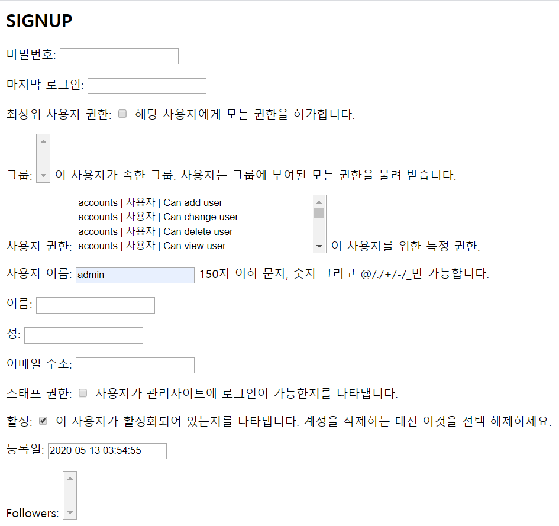
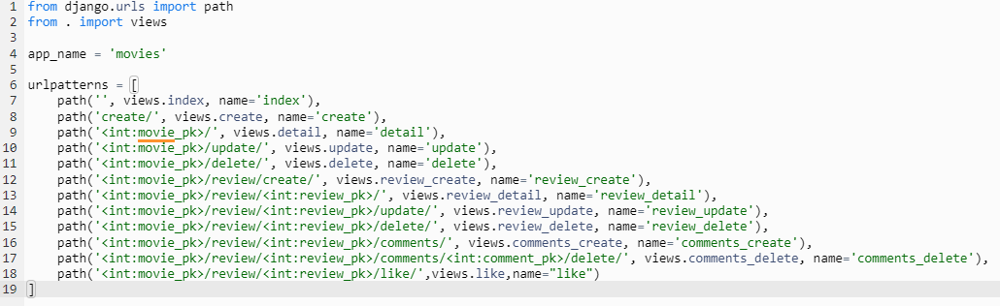
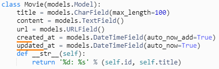
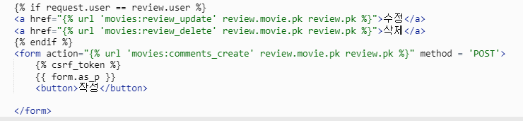
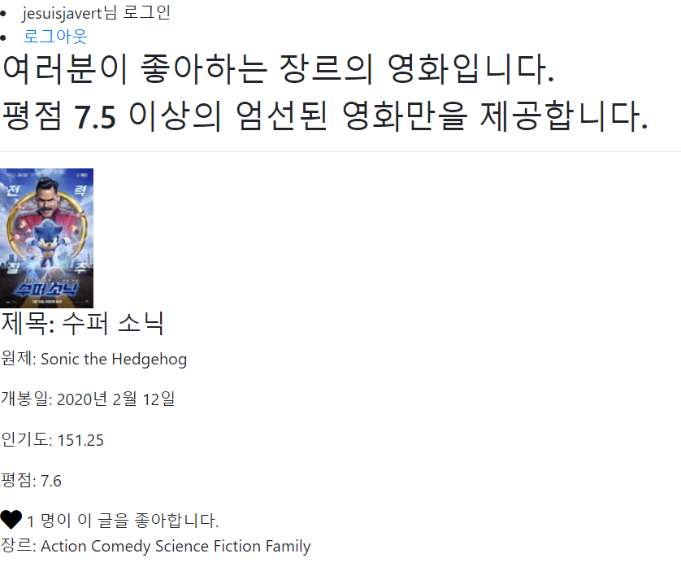

# Django README repo

#### Django Project들을 하며 작성한 README 파일들을 모아놓은 레퍼지토리입니다.

Django를 처음 개발하며 마주쳤던 여러 오류들과

이를 해결하는 과정들을 정리해둔 개발 '오답노트'입니다.

<hr>


# 0408 webproject CRUD

1. models 만들때 IntegerField에 범위를 지정해주고 싶어서 검색해봤는데 max_length처럼 간단한 방법이 있는 줄 알았는데, 전혀 아니었다. 인터넷에 검색해 보니 여러가지 방법이 많았지만 그 중 가장 쉬워보이는 방법은 Validator를 쓰는 방법이었다.

```python
from django.db.models import IntegerField, Model
from django.core.validators import MaxValueValidator, MinValueValidator

class CoolModelBro(Model):
    limited_integer_field = IntegerField(
        default=1,
        validators=[
            MaxValueValidator(100),
            MinValueValidator(1)
        ]
     )
```

​	stack overflow에서 찾았는데 이러한 방향이 그나마 따라하기 쉬워보였다. 일단 다 해보고 models 지 	웟다가 시간 나면 해보기로 했다. 결국 시간이 부족해서 못했다. 아쉬움

2. admin 만들때 처음에 admin.py안에 적어줘야 하는 항목들 안 적고 아무생각없이 admin 만들었더니 게시글들을 하나도 안불러오는 문제가 발생했다. admin을 조금 수정해보고 다른 아이디 admin1으로 만들었는데도, 제대로 admin이 안되는걸 발견. 어떡해야 admin 을 제대로 등록 시킬수 있을까?

일단 그래도 성과는 admin 계정이 여러개 만들어 진다는 사실. 그리고 admin페이지에서 지우기도 손쉽게 가능하다. 나중에 알고보니 apps.py가 아니라 admin.py 을 건드렷어야 햇는데 둘이 비슷하게 생겨서 착각햇던거엿음.

3. review_list 가 처음에 review_llist.html에서 출력되지 않음.

/ community/templates/community 밑에 html들이 들어가야 하는데 community 는 만들어 놓고 그 안에 html이 좌르르 같은 디렉토리에 있으니까 이상한 점을 눈치 채지 못했었음. 그래서 디렉토리 변경했음. 그 뒤에 review_list for문으로 출력 시키려 했으나 나오지않음. urls에 문제가 있나 한참 찾았는데 review list에 h1태그를 입력해봐도 출력되지 않는걸 확인. 원인은 extends를 해놓고 block body를 안해서 발생한 문제. blockbody endblock으로 찾아줌. base.html extends를 해주면 항상 기본적으로 blockbody를 맨 위 아래에 넣어줘야 할 듯

2. html 수정중에 완료된 부분은 내버려두고, 틀린부분 참고 할 게 있어서 잠시 주석처리를 해두었는데, 주석처리에 조차 오류가 있으면 오류가 떠서 페이지가 출력이 안되는 걸 발견. html은 주석처리가 강력하지 않은 것 같다.

3. csrf token 계속 오타가 나서 endblock이 없다고 오류 메시지가 뜨길래 그게 문제인줄 알고 위치를 계속 바꿧다 .body를 씌웠다 지웠다 위치를 바꿨다 말았다 난리 쳤는데 알고 보니 csrf_token 이었다.. 언더바를 잊지 않도록 해야 할 것 같다.

4. 부트 스트랩 적용하는 과정에 navbar와 table은 나름대로 그 전에 해 본 경험이 있어서 이것저것 참고해서 만들어 보니 쉽게 만들 수 있었는데, form.html 이 너무 보노보노였다. 부트 스트랩 documentation 에서 form 예제를 찾아 다음과 같이 만들었다.

```python
<form>
  <div class="form-group">
    <label for="title"> Title </label>
    <input type="text" class="form-control" name="title" value="{{review.title}}">
    <small id="emailHelp" class="form-text text-muted">리뷰의 제목을 작성해주세요.</small>
  </div>
  <div class="form-group">
    <label for="movie_title"> Movie Title </label>
    <input type="text" class="form-control" name="movie_title" value="{{review.movie_title}}">
    <small id="emailHelp" class="form-text text-muted">영화의 제목을 작성해주세요.</small>
  </div>
  <div class="form-group">
    <label for="rank"> Rank </label>
    <input type="text" class="form-control" name="rank" value="{{review.rank}}">
    <small id="emailHelp" class="form-text text-muted">영화의 평점을 매겨주세요.</small>
  </div>
  <div class="form-group">
    <label for="exampleFormControlTextarea1"> 내 용 </label>
    <input type="text" class="form-control" name="content" value="{{review.content}}">
    <small id="emailHelp" class="form-text text-muted">리뷰를 작성해 주세요.</small>
  </div>
  </div>
  <button type="submit" class="btn btn-primary">Submit</button>
  <a href=""> Back </a>
</form>
```

이렇게 까지 열심히 했는데 이 방법으론 도저히 input값이 넘어가지가 않았다. 문제점을 잘 모르겠다..

그래서 form을 좀 더 쉽게 받을 수 있는 방법이 없나 하고 찾아보니 bootstrap4에 crispy forms 라는 앱이 있다는 것을 알게 되었다. 바로 pip install django-crispy-forms 깔고, installed apps 에 crispy-forms를 등록해주고, 제공해주는 템플릿으로 만드니까 form 도 보노보노를 벗어나게 되었다.

```





<div class="d-flex justify-content-center">
  <form method="post" novalidate>
    
    {{ form|crispy }}
    <button type="submit" class="btn btn-success">Save</button>
  </form>
</div>

```

그런데 기본적으로는 왼쪽 정렬되어 있어서 너무 보기 안 좋길래, bootstrap에서 form 태그를 div로 묶어 flex로 만들어 중앙으로 정렬해줬다.

그리고 이유는 모르겠지만 예제에는 block content로 제공 되었는데 block content는 출력 되지 않았고 block body로 바꾸니까 출력이 되었다. 왜인지는 모르겠음.

1. 중간 중간 url을 부트스트랩에 적용시키는 과정에서 하드코딩으로 넣은 url들이 제대로 url 위치를 적용 받지 못하는 문제점이 많이 발생했었다.  형태를 잊지 않아야 할 것 같다.
2. html에서 에러가 난다고 나오지만 실제로는 views에서 에러가 나서 문제가 되는 곳이 종종 있었다. Error 메시지의 가장 커다란 부분만 읽지 말고 세밀하고 꼼꼼하게 읽어야 할 것 같다.
3. 특히 html에서 뜬금없이 bootstrap CDN에서 오류가 뜬다고 하는 문제가 많이 발생했는데, 전혀 틀린 부분이 없었다. 알고보니 url설정이 잘 못 되어 있었는데 그곳의 {} 가 다른 위치에서 오류를 발생시키기도 하는 것 같았다.
4. 부트스트랩 테이블에 Review_list들을 출력 시키는데 크기를 내 맘대로 하고 싶었으나, 잘 되지 않았다. class 에 col-숫자 총 합이 12가 되도록 설정하는 걸로 기억했는데, 의도치 않게 우측 정렬되거나 비율이 맞지 않았다.


## 2020 04 22 django-pjt3 README

#### 1. 역할분배

팀 역할 배분에 관해 고민을 그 전에 많이 했었는데, 그냥 서로 다른 기능을 만들다가 괜히 이상한 부분에서 오류가 나서 못 잡아낼 바에야, 그냥 계속 전화통화를 하면서 한 화면을 보는 것이 오류를 가장 적게 만들어 낼 것 같아서, 7:3보다는 5:5의 비율로 서로 코딩을 완성해 나가기로 하였다.

#### 2. 구현순서

명세서를 읽고, 기능을 만들 계획을 navbar / accounts / community 순서로 만들기로 했다. base.html 인 navbar가 먼저 있어야 다른 html들간의 페이지 이동이 쉬울 것이라 생각했기 때문이다. 후에 navbar는 먼저 만든 건 잘한 일이었지만, accounts보다 community를 먼저 만들걸 하고 후회했다.

#### 3. 기본구성

settings, base.html, 부트스트랩 설정, 기본적인 navbar 구성부터 했다. 초반은 그래도 몇번 해본 과정이 대부분이라 그리 어렵지 않았다. base_dir을 지정해주는 것은 까다로우니 조심해야 한다.

#### 4. Accounts

##### 1) 로그인 기능 http method POST를 처리하는 방법 중 명세서에 표현이 어려운 부분이 있었다.

```
2. 로그인 하기 전, 기존 URL이 함께 넘어왔다면 해당 URL로,
3. 넘어오지 않았다면 전체 리뷰 목록 페이지로 redirect 합니다. 데이터가 유효하지 않다면
	에러 메시지를 포함하여, 데이터를 작성하는 form 을 사용자 화면에 표시합니다. 
```

 여기에서 처음에 '''기존 url이 함께 넘어왔다면''' 이라는 문장이 어떤 말인지를 이해하기가 힘들었다. 그러나 이내 이게 auth_login 을 할 때, detail페이지이든 , review_list 페이지 이든 여러 url에서 login 을 들어갔을 경우를 상정한 문장이라는 것으로 이해하고, 크게 무리 없이 넘어 갈 수 있었다.

##### 2) 하드타이핑

 처음엔 render와 redirect 모두 URL을 하드타이핑 하지 않고, 이름을 읽는 방식으로 작성해서 서버를 열어 보았으나, 에러가 발생함을 알아채고 render 부분은 하드타이핑 방식으로 구현하여 에러를 제거하였다.

##### 3) 모델링의 중요성

account 기능은 기본 django가 사용하는 User Creation Form을 사용했기에 , 모델링을 하지 않고 진행을 했다. 차후 community기능을 구현 한 뒤에 Form을 만들고 그제서야 migration과 admin 기능을 사용 할 수 있었는데, 그렇다보니까 accounts를 작업할 때, 서버에서 하나하나 지금껏 작성한 코드가 맞는지 확인 할 수가 없어서 어려움을 겪었다. 작업의 순서를 설정할 때, 기본 crud 기능을 먼저 구현해두어야 admin superuser 기능을 사용할 수 있기 때문에, migrations를 먼저 해두어야 작업이 용이하다는 것을 깨달았다.

##### 4) is authenticated

```html



```

와 같은 방식으로 유저가 권한이 있을 때 html에서 표시되는 부분, 표시 되지 않는 부분을 따로 선정해서 출력되게 만들었다.

##### 5) form action의 url 설정

#### 5. community

##### 1) CRUD 기능 순서별로 구현

##### 2) @login_required

```python
from django.contrib.auth.decorators import login_required
```

login required라는 decorators를 어느곳에서 불러와야 하는지 어려움을 겪었는데, 탁희 강사님의 수업 노트를 보고 찾았다. 그 뒤 login이 필요한 기능들 위에 모두 적용 시켜 주었다.

##### 3) detail , update, delete에서 review_pk. pk=review_pk

review_pk , pk=pk, pk=review_pk 등등.. pk를 적용 시키는 부분에서 많이 헷갈려 오류가 많이 발생했었다. 서버를 열어볼 때마다 새로운 오류가 새로운 곳에서 발생하는 것이 신기했다.

##### 4) redirect페이지를 어디로 연결해줘야 하는지 세세하게 따져봐야함

명세서에서 어떠한 경우 어느 페이지로 연결에 관해 굉장히 세세하게 명세되어 있었는데, 그냥 다 review_list로 연결해버리고 싶은 충동을 느꼈다. 인내심을 가지고 진행해서 명세표 대로 원하는 곳으로 redirect될 수 있도록 등록 하였다.

#### 6. admin 등록

```python
from django.contrib import admin
from .models import Review, Comment
# Register your models here.
admin.site.register(Review)
admin.site.register(Comment)
```

 admin을 위해 review와 comment를 둘 다 불러와 줘야 하는 것을 잊지 않기.

#### 7.가장 큰 어려움 models.py 와 forms.py

```python
from django import forms
from .models import Review, Comment

class ReviewForm(forms.ModelForm):
    class Meta:
        model = Review
        fields = ['title','movie_title','rank','content']

class CommentForm(forms.ModelForm):
    class Meta:
        model = Comment
        fields = ['content',]
from django.db import models
from django.conf import settings

# Create your models here.
class Review(models.Model):
    title = models.CharField(max_length=100)
    movie_title = models.CharField(max_length=30)
    rank = models.IntegerField()
    content = models.TextField()
    created_at = models.DateTimeField(auto_now_add=True)
    updated_at = models.DateTimeField(auto_now=True)
    user = models.ForeignKey(settings.AUTH_USER_MODEL,on_delete=models.CASCADE)

class Comment(models.Model):
    content= models.CharField(max_length=200)
    created_at = models.DateTimeField(auto_now_add=True)
    updated_at = models.DateTimeField(auto_now=True)
    review = models.ForeignKey(Review, on_delete=models.CASCADE)
    user = models.ForeignKey(settings.AUTH_USER_MODEL,on_delete=models.CASCADE)
```

Community 기능을 구현할 때, model 관련한 명세서에서 user를 등록해줘야 한다고 했었다. review와 comment에는 어짜피 각 글의 pk값이 알아서 저장될 것이라고 생각해서 처음에 만들때

```python
user = models.ForeignKey(settings.AUTH_USER_MODEL,on_delete=models.CASCADE)
```

이 부분에 관한 생각을 해주지 못한 채, migrations를 진행 했었다.

나중에 각 review 별로 그것을 저장한 user의 Foreign key 값이 필요하다는 것을 깨닫고, migrations를 다시 해야 하는 어려움에 처했었다.

그래서 migrations 내에 "**init**.py" 파일은 내버려두고, 나머지 파일을 지우고, dblite3도 지우고 다시 세팅을 했어야 했는데, 이 부분에서 init 파일까지 통채로 지워버려서 지금까지 만들어놓은 더미데이터도 날리고, 기능들도 정상 작동하지 않는 부분이 있어 1시간 가량을 낭비 했었다.

처음에 model을 만들 때 더욱 조심했어야 하는 부분이라고 생각한다. 특히 ForeignKey에서 settings를 지정해줬어야 하는 부분이 미숙해서 더욱 어려웠던 것 같다.

form도 fields를 all로 지정해줬더니, user의 foreign key가 이상하게 출력되어 보여지는 경우가 발생해서, 결국 user를 제외한 모든 부분을 하나하나 입력해줘야 한다.

#### 8. html 파일들에서 request.user == review.user 가 같을때에만 update와 delete가 출력하게 하는 기능

```python

<a href="">UPDATE</a>
<a href="">DELETE</a>

```

이런식으로 작성하여서, 로그인한 user와 리뷰를 쓴 user가 같을 때에만 수정/삭제가 가능하도록 만들었다.

#### 최종 느낀 점:

팀프로젝트에서 각 기능별로 수행을 하거나, 7:3으로 한명이 치고, 한명이 가이드 하는 방향 보다 2명이 같이 서로서로 동시에 한 화면을 작성하는 5:5방식으로 했는데, 크게 속도가 뒤쳐지지도 않고, 특히 오타가 많은 ***의 실수를 그때그때 잡을 수 있어서, 우리팀에겐 이 방식이 제일 나은 팀워크 방식이었다고 생각한다.

마지막에 서버를 켜보면, 주황색은 ***가 쓴 부분이고, 분홍색은 내가 쓴 부분이었는데 두가지 색이 얼기설기 얽혀 있는 걸 보며 뿌듯함을 많이 느꼈다.

구현해야 할 기능들이 생각보다 디테일하게 많아서 시간이 오래걸렸는데, 아직도 auth 부분이나, foreignkey 를 통해 권한 별로 기능을 구현하는 디테일까지는 완벽하게 구현하지 못해서 못내 아쉬움이 남는다.

하지만 그래도 거의 대부분의 기능을 구현했고, 오류 없이 돌아가는 페이지를 만들었고 + 팀원과 싸우지 않을 수 있음에 감사했다. 마지막으로 막판에 살짝 msg를 뿌려준 *** 형에게도 Big shout out!


# 2020 05 14 django_pjt4 README

1. #### 역할분배

   이번 프로젝트는 워낙 마음이 잘 맞는 @@@이랑 하게 되어서, 분량을 따로 나누지는 않았다. Zoom 을 활용해서, 음성으로 대화하고, 거의 같은 부분을 같이 작성하는 방식으로 해서 **5:5의 비율**이 되었다.

2. #### 구현순서

   명세서가 역대 해보았던 모든 프로젝트 중에 **가장 자유도가 높았다**. 하지만 기본 기능은 비슷했다. Movie 의 CRUD (나중엔 필요 없던걸로 밝혀지긴 했지만), Review의 CRUD, Comment의 CRUD를 **각각 1:N, 1:N, 1:N 관계로 연결**하고, **Accounts 앱을 통해 좋아요와 팔로우 기능을 구현** 하는 것이었다. 기본적으로 Accounts 앱을 먼저 만들고, Movie -> Review -> Comment 순서로 만들었다. 

3. #### 기본 구성

   settings.py, base.html, 부트스트랩 CDN설정, 기본적인 navbar 구성, url base_dir 설정을 했다.

   user Model을 기본 Django제공 User 모델이 아닌 커스텀 모델을 사용할 거라서, settings.py 마지막에 `AUTH_USER_MODEL`을 설정해주었다.

4. #### ACCOUNTS

   1. **models.py 속 User설정이 가장 중요한데,**

   ```python
   from django.db import models
   from django.contrib.auth.models import AbstractUser
   from django.conf import settings
   
   class User(AbstractUser):
       followers = models.ManyToManyField(settings.AUTH_USER_MODEL, related_name='followings')
   ```

   다음과 같이 AbstractUser를 불러와, **팔로워, 팔로잉을 역참조 할 수 있도록** `related_name` 설정을 해주는 것이 중요하다.

   기본 Accounts `signup, login, logout, follow, profile` 기능을 구현하였다.

   ​	2. 다만 그 과정에서 중간에 signup의 `CustomUserCreationForm`의 인자값을 `__all__` 로 받으면 어떻게 되나 궁금해서 실험해 보았는데 다음과 같이 매우 개판으로 나왔었다. 바로 fields에 직접 지정 하는 방식으로 바꿨다.



​	3. **accounts 앱의 팔로우와 좋아요 기능을 어느 곳에 달아야 할지 UI/ UX 적인 측면에서 고민을 많이 했다.** 처음 accounts 앱을 만들 당시에는 서로의 프로필을 주소창에 직접 입력해야만 들어갈 수 있었기 때문에, 이후 movies app을 완성 한 후, 각자가 리뷰를 쓰면 그 리뷰를 쓴 사람의 리뷰 유저 네임에 accounts/profile 태그를 달아 들어가 그 사람을 팔로우 할 수 있도록 만들었다. 

#### 5. movies

1. **가장 어려웠던 것은 모델링이었다.**  accounts를 제외하고서라도, 1:N 이 3중으로 종속 되어 있는 관계를 어떻게 만들까 고민하는게 가장 까다로운 일 이었다. 처음엔 기능별로 app을 나누어 작업 하다가, 각 app끼리 url 정보를 넘기는 것에서 문제가 발생해서, 아예 movies라는 app 하나에 `movies`와 `reviews` `comments` 까지 전부 넣었는데, 이는 나중에 프로젝트를 싹 갈아 엎고, 그 뒤로도 url 설정과 views.py 에 인자값 넘겨주는 것에 매우 골머리를 썩게 만드는 결과를 가져왔다. 왜 강사님들이 `'하나의 앱, 하나의 기능'`을 강조 하시는지 몸소 깨우칠 수 있었다.

2. url patterns를 짜는 것부터가 고역이었다.
   

   url에 `movie_pk`, `review_pk`,`comments_pk`까지 세개를 중첩해서 쌓다보니 **views.py 에 인자값을 넘길때 고생했다.** url이 길어지는 것은 실제 개발할때는 어쩔 수 없이 오는 문제겠지만, 굳이 한 앱에서 저렇게 까지 할 필요는 없는 것 같다.

3. models.py 는 movie에 URLField()를 넣는 것. Review에 user정보와 like_users정보. movie ForeignKey를 넣는것. Comment에도 user정보를 넣어서 자신만 삭제가 가능하도록 했다.

4. class에 @@@ 형의 도움으로 `__str__` 을 넣었는데, 원하는 무비의 foreign key 값을 왼편엔 저장값, 오른쪽엔 출력값으로 설정해서 나중에 Review에서 movie를 참조할 때 사용 할 수 있도록 했다. 그 전엔 이걸 하는 법을 몰라 movie값을 exclude로 form에서 받아 오지 않고, commit=False로 넘기는 방법을 사용했었는데, 이런식으로 구현이 가능해서 신기하고 보람찼다.

   

5. **html 문서에서 오류가 나면 답이 없다**. review_detail에 movie namespace 가 없다는 문제로 한참을 골머리를 썩었는데, html은 정확히 어디에서 틀렸는지 정확히 파악하기 어렵기 때문에(bootstrap을 적용 시키면 bootstrap을 사용해서 html을 rendering 하는 부분에서 오류가 나는 것으로 파악을 하기 때문인 듯) 한 문장 한 문장 지웠다가 서버를 돌렸다가 하는 과정을 반복해서 디버깅을 해야하기 때문에 시간이 굉장히 오래 걸렸다. 틀렸던 부분은 html page에서도 



다음과 같은 부분에 **인자값을 여러개 넣어줘야 하는데**, review.movie.pk 와 같이 foreignkey 정방향으로 참조하는 것을 생각해내지 못해서 꽤 오랜 시간 헤매었다. 쿼리셋을 다루는 것에 더욱 익숙해져야 할 것 같다.

6. views.py 에서 가장 공을 들였던 부분은 처음으로 **오류** **message  구현**했다는 점이다.

   ```python
   @login_required
   def review_update(request, movie_pk, review_pk):
       review = get_object_or_404(Review,pk=review_pk)
       if request.user == review.user:
           if request.method == 'POST':
               form = ReviewForm(request.POST, instance=review)
               if form.is_valid():
                   form.save()
                   return redirect('movies:review_detail', movie_pk, review_pk)
           else:
               form = ReviewForm(instance=review)
           context = {
               'form': form
           }
           return render(request, 'movies/review_form.html', context)
       else:
           messages.warning(request,'접근권한이 없습니다.')
           return redirect('movies:review_detail', movie_pk, review_pk)
   ```

   이와 같은 방식으로  request.user가 review.user가 아닐 때 접근 권한이 없다는 메시지를 넘겨 줬는데, 이를 동작하기 위해선  settings.py에 아래와 같은 코드를 넣는 것이 신기했다.

   ```python
   MESSAGE_STORAGE = 'django.contrib.messages.storage.session.SessionStorage'
   ```

   

7. #### 총평

   그 전 장고 프로젝트를 할 때, CRUD 로직을 세우는 것은 코드의 진행 알고리즘을 따라 한다는 느낌이 강했는데, 이번 프로젝트는 자유도도 높고, 무엇보다도 모델링을 내가 주도적으로 진행해야 했기 때문에, 내가 직접 프로젝트를 **'만든다'**라는 개념이 강해 더욱 헤매고 어려웠던 것 같다.

   특히, **더욱 정교하게 첫 모델링 설계를 해야만 나중에 고생을 덜 한다**는 것을 깨달았다. 모델링은 마이그레이션을 다시 해야하기 때문에 모델링을 아무리 심사숙고하고 짜도 결국 또 기능을 하나하나 구현 할 때마다 수정을 하게 되고, 그때마다 migration을 처음부터 다시 시작하는 것은 여간한 노동이 아니었다. 처음부터! 잘하자!

8. #### 잘한 점

   1. html에 if문, is authenticated, views.py의 메시지 기능을 통해 '권한'에 대한 차등등급을 정밀하게 구성한 것.
   2. 메시지 기능, ForeignKey에서 select하는 기능 등 views.py 에서 새로운 기능들에 도전해봄
   3. user에게 보여지는 부분에 대한 UI/UX 고민을 많이 해보고, 각 기능들을 서로 엮으면서 재미를 느낌

9. #### 못한 점

   1. 3개의 모델링을 한 앱에 때려 박은 것(처음 설계는 여러 앱으로 했지만 쉬운길로 가고 싶어서 빨리 포기하고 한 앱에 때려 넣은것이 오히려 더욱 큰 독이 되었다.)
   2. 역참조, 정참조 등 객체를 받아올 때 쿼리문 다루는 것에 서툴러서 시간을 많이 낭비한 것.
   3. html에서 오타를 발견하지 못하고 시간을 많이 끈 것


# 2020 05 20 django_pjt5 README

### 1. 역할분배

이번 프로젝트 역시 @@@과 맡게 되었다. 평소에 @@@는 아주 믿을만한 동료임에 틀림없지만, 문제는 이번주 @@@의 스케쥴 문제로, javascript 수업을 못 들은채로 함께하게 되어, javascript관련한 내용 전부와 모델링 부분을 내가 맡게 되어 프로젝트를 함에 있어서 어려움이 많았다. Zoom 을 활용해서, 음성으로 대화했고,  8:2의 비율로 대부분 내가 작성하게 되었다.

### 2. 구현순서 및 제작방향

크게는 명세서 순서에 따라 제작했다. 기본적으로 구현 할 아이디어를 여러가지 내었는데, 사실 시간과 정성이 훨씬 많이 드는 아이디어 위주로 나와, 최대한 간단하게 우리가 익숙한 기능을 구현하는 방식으로 구성회의를 하고, 앱 순서대로 `json데이터 입력 -> Accounts -> Movies` 순서로 만들었다.  
 우리가 만들기로 한 영화추천 알고리즘은 `원하는 장르를 선택하면, 그 영화를 인기도 순으로 10개씩 정렬하되, 평점이 7.5이상인 영화만 추천하는 것`. 장르 선택은 모델링 정방향 참조, 인기도 순 10개씩 정렬은 Bootstrap pagination, 평점 filtering은 쿼리셋 filtering으로 구현했다.

 또한, 필수 기능 이었던,  `'좋아요'의 활성화/비활성화는 AJAX 요청을 사용 해야 합니다.` 를 javascript로 구현하기 위해 axios 툴을 이용해야 했다.

### 3. 기본 구성

1. ##### 작업 환경

   - 이번 주 과제는 vscode를 활용한 가상환경에서 진행하기를 강사님들이 추천하셨지만, 가상환경을 zoom으로 보는 건, 한 명이 타이핑을 전적으로 도맡아서 해야하기 때문에 실시간으로 서로 다른 부분을 작성하는 팀프로젝트엔 어울리지 않는다고 판단해, 다시 c9을 활용해 작업을 했다. 실제로 코드를 봐가며 협업을 하더라도, 아이디어가 떠오른 한 명이 손을 놓고 다른 사람이 작성하는 걸 구경만 하는 건 굉장히 답답할 것 같다.

2. ##### 기본 django Setting

   - `부트스트랩` CDN설정, `axios` CDN 설정, django-`pagination`설정,`fontawesome`CDN 을  base.html 와 settings.py에 구성했다.  
   - 각각의 인터넷 사이트를 모두 즐겨찾기 했다. 대부분 startproject하는 법을 적어 놓았기에, 그런 문서들을 참고해서 적었다. 특히 bootstrap pagination 이 설정하는 법이 까다로웠는데, 여러 단계를 거쳐 사용할 수 있었다.

   - 그 외에도 createsuperuser를 통해 admin 페이지도 만들었다. id : admin / pw: 1

3. ##### `json` 데이터 불러오기

   1. 처음 기본 제공된 json 파일을 migration 하는 것을 처음 해봐, 몇번의 실수 끝에 해결 할 수 있었다. json data를 받아 오는 방법은 간단하나, 몇 번의 시행착오 끝에 겨우 해냈다.

      1. 기본 모델링을 완료한 뒤, makemigrations를 통해 틀을 만들어 줄 것.

      2. 넣고 싶은 app에 fixtures 라는 폴더를 생성하고 그 안에 json 파일을 넣을 것.

      3. json file을 손상하지 않고(...파트너님(ㅎㅎ?)) 콘솔창에 다음과 같은 명령어를 입력한다.

         ```cmd
         python manage.py loaddata moviedata.json
         ```

    

### 4. Accounts app

1. ##### 기본 아이디어

   - 원래는 User 모델에 age를 입력하여, 나이대 별로 json 데이터의 adult 값(True or False) 를 이용하여 청소년에게 청소년 관람 불가 영화를 추천해주지 않도록 하려 했으나, 제공 받은 json database에 `adult`값이 전부 **false**로 되어 있어서(아마 강사님이 성인물은 제외하고 데이터를 제공하신 것 같다.. 철저하시긴), User modeling 해놓은 것은 싹 밀고 다시 migration 했다.  처음 우리의 아이디어 중에, User의 성별이 male / female 일때를 입력받고, 남자는 모두 adult video만을 추천하려고 했던 아이디어가 구현 할 수 없게 되어 매우 아쉬웠다(?).

2. 그래서 기본 `signup, login, logout` 기능을 구현했다. Simple is the Best

### 5. Movies

1. 기본적으론 `CR` 기능을 통해, movie에 관한 데이터를 생성은 할 수 있도록 만들었다.

2. 사실 내가 만약 Modeling을 했어야 했다면, 아마 하루종일 모델링만 하느라 날이 다 갔을 텐데, 다행히 코드를 제공해 주셔서 감사하게 사용했다. 다만 좋아요 기능을 구현하기 위해, `Movie`에 `like_users `라는 항목을 M:N 관계(ManyToManyField)로 설정했다.

3. **views.py에 index 함수에 공을 많이 들였다.**

   ```python
   def recommand_genre(request, genre_id):
       movies = Genre.objects.get(id=genre_id).movies.order_by('-popularity').filter(vote_average__gte=7.5)
       paginator = Paginator(movies,10)
       page_number = request.GET.get('page')
       page_obj = paginator.get_page(page_number)
       context = {
           'movies': movies,
           'page_obj':page_obj
       }
       return render(request, 'movies/recommand_genre.html', context)
   ```

   처음 movies로 받아오는 것에서 쿼리셋을 popularity로 내림차순 정렬하고, 필터를 통해 vote_average를 7.5이상 값으로 설정하는 것에서 수많은 시행착오를 반복했다. 쿼리문을 좀 더 자유자재로 다뤄야 하는 연습이 필요한 것 같다. 나머지 paginator와 page_obj를 통해 bootstrap pagination 기능을 구현했는데, https://pypi.org/project/django-bootstrap-pagination/ 사이트의 예시를 보고 따라했다. pagination은 setting도, 함수도, html문서도, 고려해야 할 것이 참으로 많은 기능이라는 것을 실감했다. 다 해놓고 보면 맨마지막 한 줄 밖에 나오지 않아 굉장히 허무했다.

4. html 문서도 javascript를 뜯어보며 치느라 고생을 많이 했는데, 막상 다 해놓고 봐도, 큰 화면에 하트 하나만 떨렁 바뀌는게 허무한 마음이 많이 들었다. 

5. `for 문 돌릴때 꼭 context내의 page_obj 를 통해 돌릴 것!`

6. pagination 설정을 html 문서의 맨 위에도 달아주어야 한다!

7. javascript 코드를 어제 배웠던 것의 대부분은 이해 했다고 생각했는데, 하나하나 다시 작성하며 뜯어 보니 대충 이해해서 왜 이런식으로 쓰였는지 의문이 나는 점이 있어, 강사님께 질문폭탄...

8. 장르도 영화 하나당 여러개가 지정된 경우가 많아서 for문을 돌려 출력해야 했다.

### 6. 총평



처음 프로젝트를 받아 읽어보았을 땐, 구현해야 할 내용이 많지 않아 수월하겠다고 생각했는데, 경기도 오산이었다. 모델링의 쿼리셋을 자유자재로 다루지 못했기에, 간단한 '각 영화에 딸린 모든 장르 출력' 과 같은 기능도 구현할 때 애를 먹어서, 더욱 복습의 중요성을 깨닫게 되었다.

 특히, javascript 부분은 거의 혼자 진행해야 했기에, 파트너의 도움 없이 혼자 진행하는 버스기사들의 마음이 이런 것이구나 하고 깨닫게 되었다. 

### 7. 잘한 점

1. 각종 bootstrap pagination, axios, fontawesome 등 외부 라이브러리를 잘 이용하여 사이트의 명세를 하나도 빠짐없이 수행하는 사이트를 만든 점.
2. 나름 합리적인 추천 알고리즘을 통해(좋아하는 영화장르 중 평점 7.5이상의 인기도 순 내림차순 정렬 pagination) 소비자들에게 '유용한 정보'를 제공하는 사이트를 만들 수 있었던 점.
3. javascript를 통해 좋아요 기능을 구현하는 연습을 통해, '비동기적' 사이트를 구현하는 법과 친해진 점.

### 8. 못한 점

1. 더욱 세밀한 modeling과 user의 개인 정보에 따라 추천 알고리즘을 세밀하게 짜지 못한 점.
2. 중간중간 학급 자치회 임무로 인해 시간을 많이 뺏겨, 프로젝트에 집중하지 못하여 시간이 늦어진 점.
